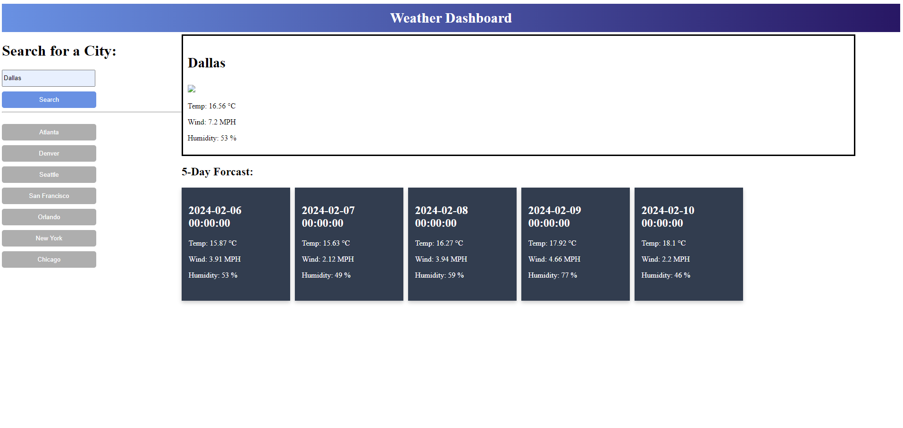

# Wheather-Dashboard

## Description
    this web application lets user search any location and get the current weather forecast. Plus a five day forcast of the week.
## Installation
    N/A
## Instructions
    Type a location in the search input and click search.
## Screenshot
    
## Usage
    Allows user to get current forecast and forecast of the week..
## Test
    N/A
## Credits
    N/A
## License

## How to Contribute
    N/A
## Features
    Current weather, five day forecast.
## Questions
https://github.com/RyanPersaud03?tab=repositories
n/a
    